# Perish

- **Title**: Perish
- **Composer**: Xinyue Hu

<iframe width="560" height="315" src="https://www.youtube.com/embed/aFjIjid-r0I?si=MTTE_pGWXrVRxi9w" title="YouTube video player" frameborder="0" allow="accelerometer; autoplay; clipboard-write; encrypted-media; gyroscope; picture-in-picture; web-share" referrerpolicy="strict-origin-when-cross-origin" allowfullscreen></iframe>


# Description
In this chapter, the protagonist discovers that his so-called war is just an excuse for the rulers of their own country to invade other countries and plunder resources. He is not a hero but a murderous devil. His worldview crumbled. In the end, he went to destruction in the chaos.

**This chapter is composed of four parts**

**Part 1**: The protagonist is awakened by a sharp, cloying smell of blood. Upon seeing mountains of corpses piled around him, he gradually realizes that he is a devil who has committed countless murders, and this revelation fills him with terror and loneliness.

**Part 2**: The protagonist learns the truth about war—everything is a lie, and war itself is absurd.

**Part 3**: The protagonist’s core beliefs collapse. Both his mind and body bear the scars of war’s devastation, and when he reflects on his past, he is overwhelmed by endless regret.

**Part 4**: Deeply disappointed in both himself and the world, the protagonist, engulfed in sorrow and despair, chooses the path of self-destruction.

# Files and Resources
There are 3 folders which includes GibberCode, PurrData and Visual and contians all the materials of the performance.

**GibberCode**

This folder contians 4 parts of music code ( *part1.js*, *part2.js*, *part3.js*, *part4.js* each person control one of the parts) and the web connection code which is used to build the information channels between purr data and Gibber.

**PurrData**

There are 6 patches and 5 sample sounds (crashing-glass.wav[1], thunder.wav[2], reversed-crash-cymbal.wav[3] and water-drip-single-2.wav[4]) in this folder. The *User_Interface.pd* which works as an operation platform. The *Netsend.pd* works as a message sender which is responsible for sending all the messages from Purr Data to control the sound of Gibber.

**Visual**

There are 4 files in this folder including 1 main file *sketch.js* controls the visualization of the performance and 3 sub-file *particle.js*, *star.js* and *index.html*. 

# Usage

**Initialization**

To get the performance running, you need to download a software called `websocat`[5] first. After downloading it, you can then open the terminal on your computer and input the following command to build the websocket. 
```cmd
\localpath\websocat.i686-pc-windows-gnu.exe  -t -E ws-l:127.0.0.1:9080 tcp-l:127.0.0.1:9081
``` 
Next, you need to run the following code on Gibber first to let Gibber connect to the websocket.

``` javascript
socket = new WebSocket("ws://127.0.0.1:9080")
socket.addEventListener("open", (event) => {
  console.log("connected to websocket")
})
socket.addEventListener("close", (event) => {
  console.log("disconnectd from websocket")
}) 
```

Then open the netsend.pd and click the bang named "NetConnect". After that, you can start to use the User_Interface.pd to send message to Gibber.

<center>

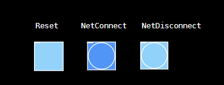

</center>

Finally, establishing the information channels. Please run the following code on Gibber.
``` javascript
socket.addEventListener("message", (event) => {
  console.log(event.data)
  tag = event.data.split(' ')[0]
  mg = parseFloat(event.data.split(' ')[1])
  intMg = parseInt(event.data.split(' ')[1])

  switch(tag){
    case "s1cutoff":
      	  s1.cutoff = mg	
      	  break
    case "voicePan":
      	  voice.pan = mg
		      break
    case "TremoAm":
		      tremo.amount = mg
          break
    case "TremoFre":
          tremo.frequency = mg
          break
    case "FlanFB":
					flan.feedback = mg
         	break
    case "FlanFre":
					flan.frequency = mg
        	break
    case "padcutoff":
		      pad.cutoff = mg
        	break
    case "bass1index":
		      bass1.index = intMg
        	break
    case "snloudness":
					sn.loudness = mg
        	break
    case "d1loudness":
	     		d1.loudness = mg
			    break 
    case "pluckecho":
		      h2.note(intMg)    
  }
}) 
```

**Playing the music**

open the *User_Interface.pd*. Then copy and paste all gibber code on Gibber. Next, run the code step by step by selecting the code and press `shift + enter`.

* part 1
  
  You can control the s1 cutoff by sliding the `s1cutoff` Hislider and make the voice sounds in different directions by changing the value of pan.

  There are 2 modulations here, one is `Tremolo` (to control the volume of an incoming signal over time[6]), the other is `Flanger` (effect with a modulated delay line with feedback[7]). You can also control s1 by changing the values of their frequency and amount using Vislider.

  <center>

  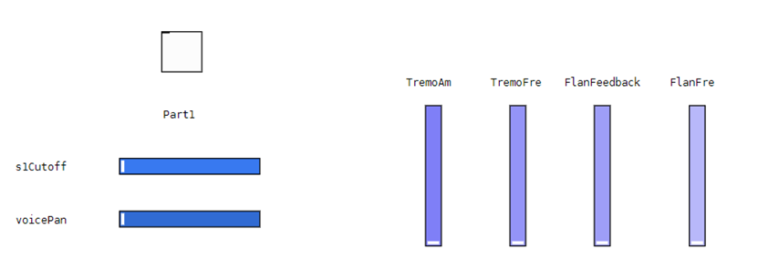

  </center>

  <center>

  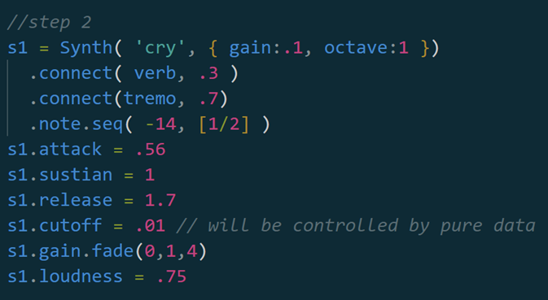

  </center>

* part 2
  
  Just as the operation in part 1 you can control the pad cutoff by using Hislider to make this lead change over time.
  <center>

  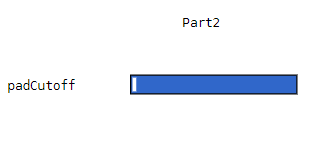

  </center>

  <center>

  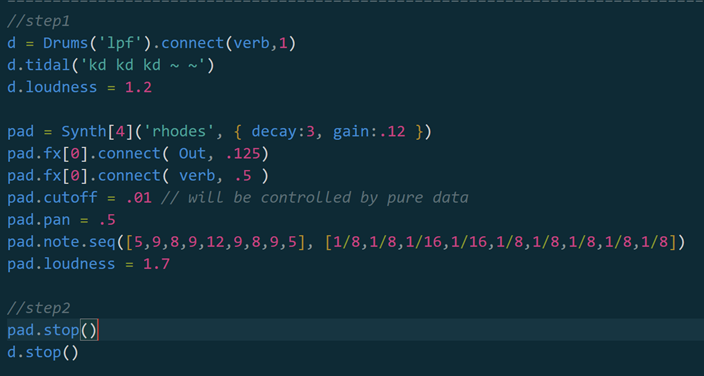

  </center>

* part 3
  
  To make the bass in part 3 sounds in different tone. You can change the value of index. Here you can just sliding the Hslider.

  In addition, you can also change the volume of snare and drums by sliding the Hslider of them to make this music more varied.

  <center>

  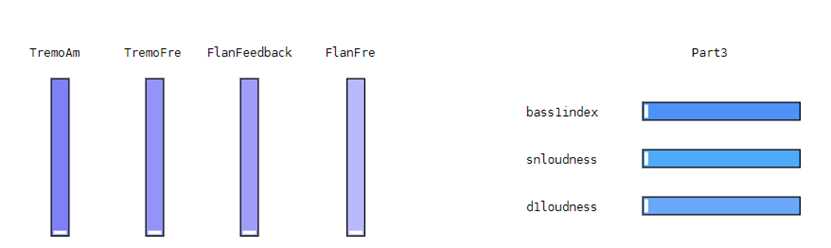

  </center>

  <center>

  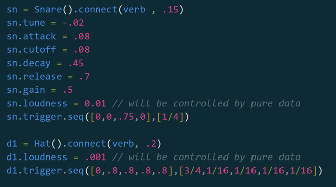

  </center>

* part 4
  
  Here the bass part was designed to palyed by using the keyboard. You can use key `S`, `D` and `F` to make different pitches.

  If you want to add more sound in this part, you can simply click the bang which controls the sample sound of cymbal and crushed glass.

  <center>

  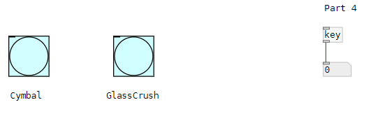

  </center>

  <center>

  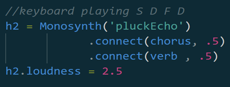

  </center>

**Interactive visualization**

  To make the visualization work in a proper way. First, you need to open the visual folder in VScode. Then, press `ctrl + shift + p` to open the command line. Next, enter the command `open with live server` and then you can play this interactive visualization art work in browser. The correct order of all scenes is 1 2 3 4.

* Scene 1
  
  To enter scene 1, you need to press `key 1`. The scene 1 will show.

  <center>

  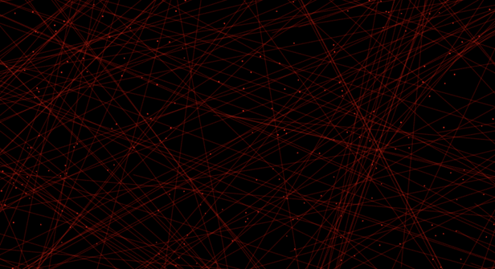

  </center>

* Scene 2

  To enter scene 2, you need to press `key 2`. You can make the water waves appear by clicking the mouse or dragging it.

  <center>

  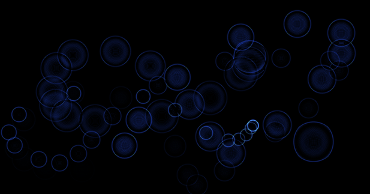

  </center>

* Scene 3 

  To enter scene 3, you need to press `key 3`. The stars will fall from the screen.

  <center>

  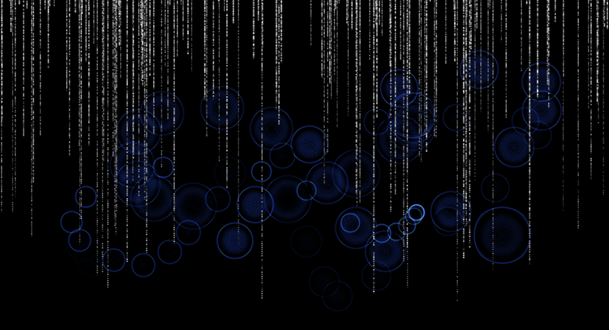

  </center>

* Scene 4

  To enter scene 4, you need to press `key 4`. You can change the shape and rotation speed/direction by sliding the sliders in the bottom. The first slider controls the shape of the circle. The second one controls the speed of shape change. The third slider controls the direction of rotation. The fourth one controls the fading of the circle.

  <center>

  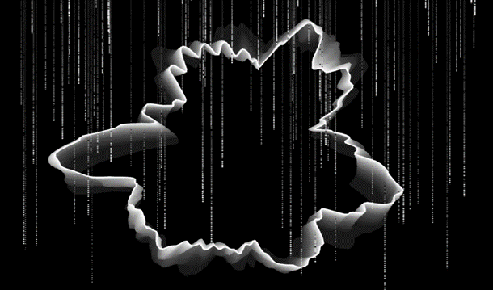

  </center>

# Performance Structure
There are 4 parts of this chapter. In the following picture, each cell is 4 beats(BPM100).

<center>

  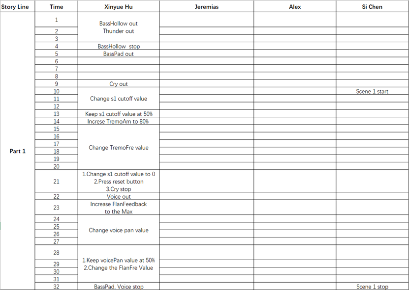

</center>

Part1 describes the protagonist's feelings of fear and loneliness since he gradually realized that he was a devil. The part 1 music was played in Gibber and adjusted in PD. The corresponding visualization is scene 1.

<center>

  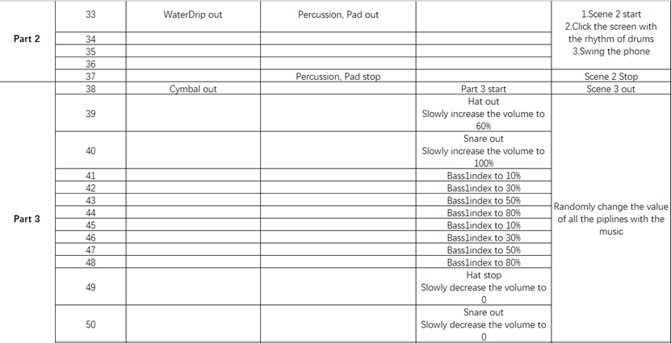

</center>

Part2 tells the protagonist learned the truth about the war that everything was a lie and war was ridiculous. The part 2 music was played in Gibber and adjusted in PD. The corresponding visualization is scene 2.

Part3 describes the protagonist's feelings of regret and tangled because his humanity has been warped. The part 3 music was played in Gibber and adjusted in PD. The corresponding visualization is scene 3 and scene 4.

<center>

  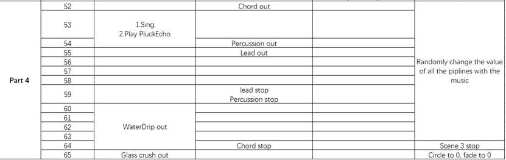

</center>

part4 describes the protagonist's feeling of deep disappointment with himself and the world, and commits suicide in grief and despair. The part 1 music was played in Gibber and adjusted in PD. It's better to chant beautifully to the music. The corresponding visualization is scene 4.

# Composition
The music was generated by my feelings and intuition.

# Caveats
1. This chapter's content is not suitable for vulnerable people.
2. To protect your hearing, please adjust the volume appropriately.
3. To avoid screen freeze, please follow the order while playing the visualization part.

# Cool things to try
1. You can use pure data to control the sound of Gibber and make the music change overtime.
2. You can use the phone sensor[11] to control the water drip sound by shaking your cell phone.
3. The visualization can be interacted with mouse and keyboard so that you can create many visual art work in your unique way.

# References
1. SoundsCrate. 2017. Crashing Glass. Retreived from<https://sfx.productioncrate.com/royalty-free-music/soundscrate-crashing-glass>
2. FlatHill. 2014. Rain and Thunder 4. Retreived from<https://freesound.org/people/FlatHill/sounds/237729/>
3. DJxM4C. 2012. Crash Cymbal with Reverb. Retreived from<https://freesound.org/people/DJxM4C/sounds/165235/>
4. SoundsCrate. 2018. Water Drip Single 6. Retreived from<https://sfx.productioncrate.com/royalty-free-music/soundscrate-water-drip-single-6>
5. Vitaly Shukela. 2022. WebsocatV1.11.0. Retreived from<https://github.com/vi/websocat>
6. Gibber Reference. No Date. Audio Effects Tremolo. Retreived from<https://gibber.cc/playground/docs/index.html#audio-effects-tremolo>
7. Gibber Reference. No Date. Audio Effects Flanger. Retreived from<https://gibber.cc/playground/docs/index.html#audio-effects-flanger>
8. Xinyue Hu. 2022. comp6720-2022-assignment-3. Retreived from<https://gitlab.cecs.anu.edu.au/u7151386/comp1720-2022-assignment-3>
9. The Coding Train. 2016. Coding Challenge #24: Perlin Noise Flow Field. Retreived from<https://thecodingtrain.com/CodingChallenges/024-perlinnoiseflowfield.html>
10. John Lewis. 2019. Moving a Noise Circle in a Circle. Retreived from<https://editor.p5js.org/JohnyDL/sketches/wZv0CEz7c>
11. Tunan Guo. 2023. Gyrosend. Retreived from<https://github.com/Tup0lev/Gyrosend>
  
>>>>>>> 41e2ec5 (Initial commit)
=======
# Perish
Sound and Music Computing Project
>>>>>>> 53c8ab6e5a17a372fad579458bae751c9b542a49
